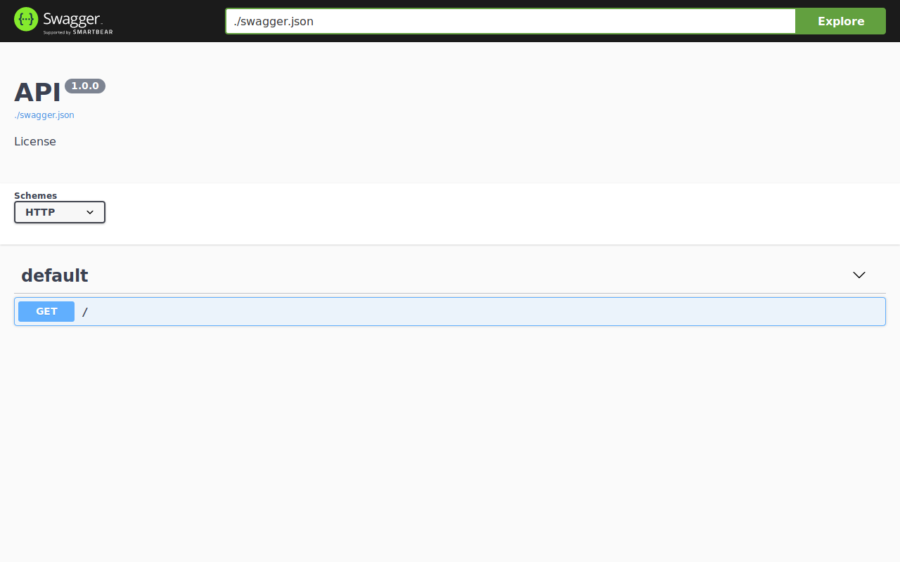

<!--Sanic-OpenAPI documentation master file, created by
sphinx-quickstart on Sat Jul 13 15:53:30 2019.
You can adapt this file completely to your liking, but it should at least
contain the root `toctree` directive.-->

# Sanic OpenAPI

Sanic-OpenAPI is an extension of Sanic web framework to easily document your Sanic APIs with Swagger UI.

## Installation

To install `sanic_openapi`, you can install from PyPI:

```shell
pip install sanic-openapi
```

Or, use master banch from GitHub with latest features:

```shell
pip install git+https://github.com/huge-success/sanic-openapi.git
```

## Getting Started

Here is an example to use Sanic-OpenAPI:

```python
from sanic import Sanic
from sanic.response import json
from sanic_openapi import swagger_blueprint

app = Sanic()
app.blueprint(swagger_blueprint)


@app.route("/")
async def test(request):
    return json({"hello": "world"})


if __name__ == "__main__":
    app.run(host="0.0.0.0", port=8000)

```

And you can get your Swagger document at <http://localhost:8000/swagger> like this:


## Contents

* [Document Routes](sanic_openapi/document_routes)
* [Configurations](sanic_openapi/configurations)
* [Decorators](sanic_openapi/decorators)
* [Fields](sanic_openapi/fields)
* [Examples](sanic_openapi/examples)
* [API Factory](sanic_openapi/api_factory)
* [API Reference](sanic_openapi/api_reference)

## Indices and tables

```eval_rst
* :ref:`genindex`
* :ref:`modindex`
* :ref:`search`
```
