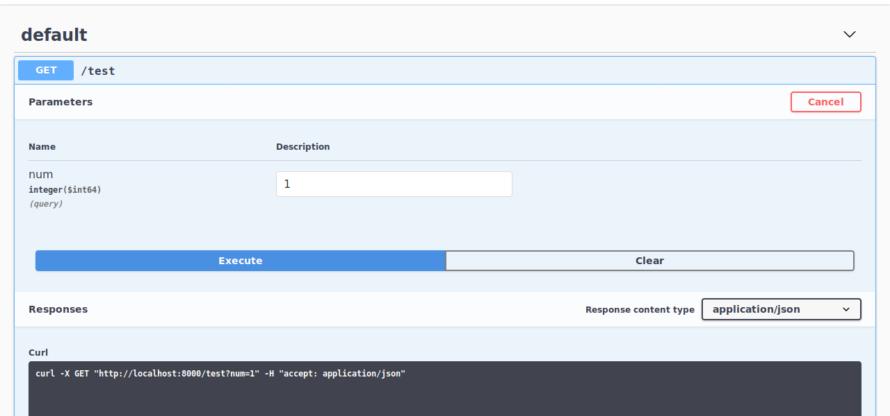
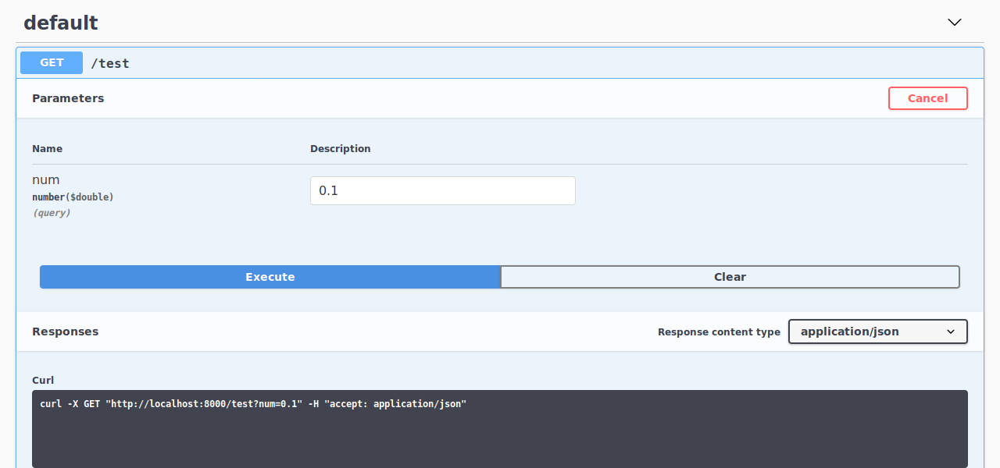
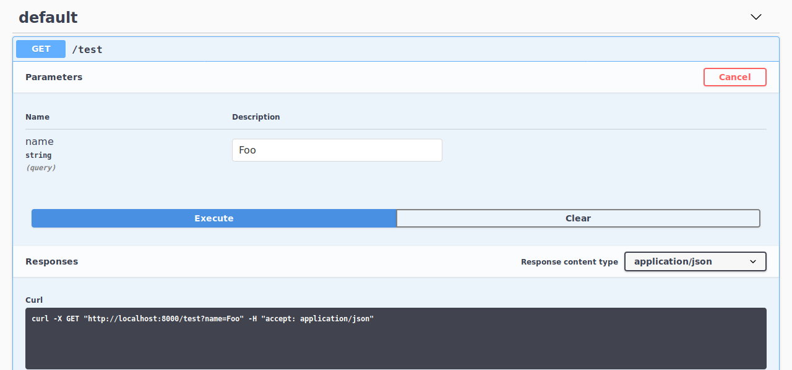
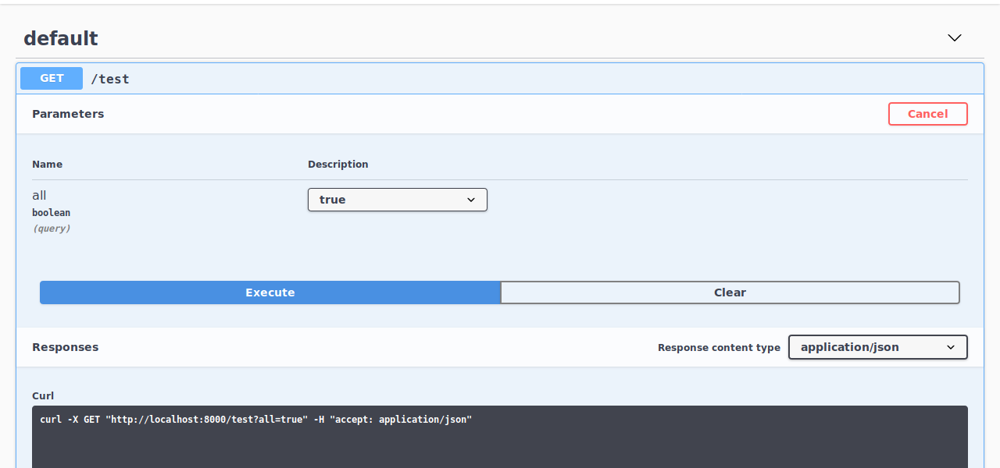
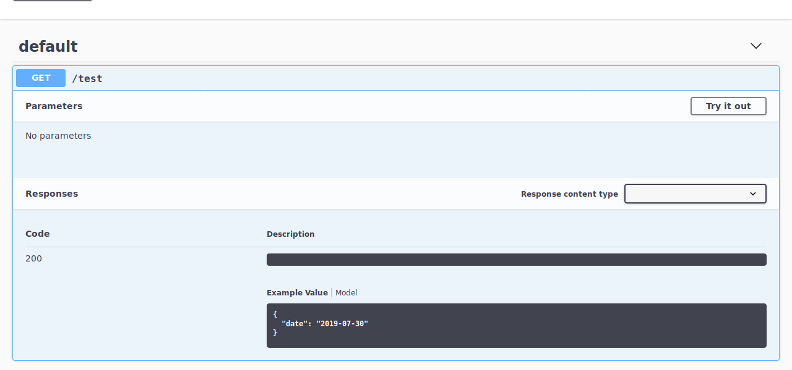
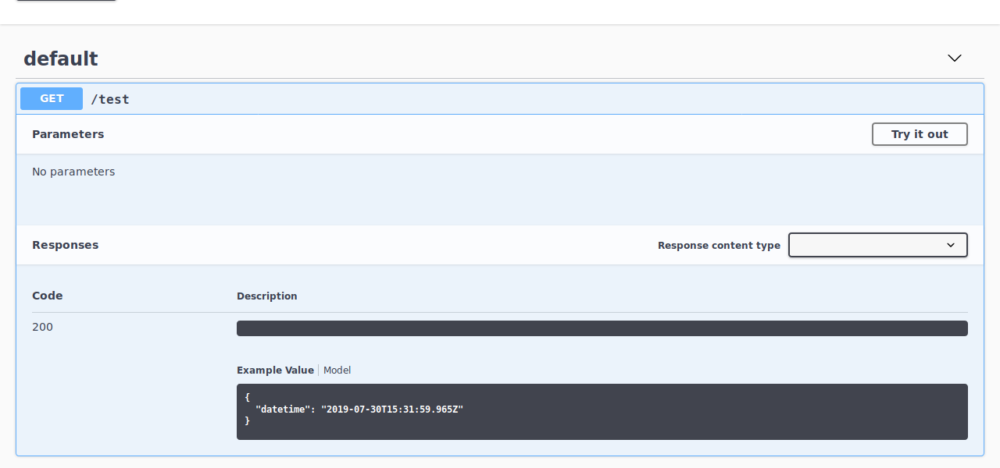
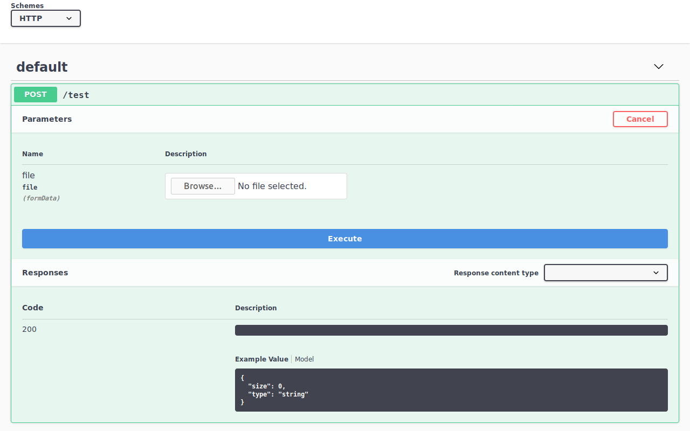

# Fields

In Sanic-OpenAPI, there are lots of fields can be used to document your APIs. Those fields can represent different data type in your API request and response.

Currently, Sanic-OpenAPI provides following fileds:

* [Integer](#integer)
* [Float](#float)
* [String](#string)
* [Boolean](#boolean)
* [Tuple](#tuple)
* [Date](#date)
* [DateTime](#datetime)
* [File](#file)
* [Dictionary](#dictionary)
* [JsonBody](#jsonbody)
* [List](#list)
* [Object](#object)

## Integer

To document your API with integer data type, you can use `int` or `doc.Integer` with your handler function.
For example:

```python
from sanic import Sanic
from sanic.response import json

from sanic_openapi import doc, swagger_blueprint

app = Sanic()
app.blueprint(swagger_blueprint)


@app.get("/test")
@doc.consumes(doc.Integer(name="num"), location="query")
async def test(request):
    return json({"Hello": "World"})

```

And the swagger would be:


## Float

Using the `float` or `doc.Float` is quite similar with `doc.integer`:

```python
from sanic import Sanic
from sanic.response import json

from sanic_openapi import doc, swagger_blueprint

app = Sanic()
app.blueprint(swagger_blueprint)


@app.get("/test")
@doc.consumes(doc.Float(name="num"), location="query")
async def test(request):
    return json({"Hello": "World"})

```

The swagger:


## String

The `doc.String` might be the most common filed in API documents. You can use it like this:

```python
from sanic import Sanic
from sanic.response import json

from sanic_openapi import doc, swagger_blueprint

app = Sanic()
app.blueprint(swagger_blueprint)


@app.get("/test")
@doc.consumes(doc.String(name="name"), location="query")
async def test(request):
    return json({"Hello": "World"})

```

The swagger will looks like:


## Boolean

If you want to provide an `true` or `false` options in your API document, the `doc.Boolean` is what you need. When using `doc.Boolean` or `bool`, it wull be convert in to a dropdown list with `true` and `false` options in swagger.

For example:

```python
from sanic import Sanic
from sanic.response import json

from sanic_openapi import doc, swagger_blueprint

app = Sanic()
app.blueprint(swagger_blueprint)


@app.get("/test")
@doc.consumes(doc.Boolean(name="all"), location="query")
async def test(request):
    return json({"Hello": "World"})

```

The swagger will be:


## Tuple

To be done.

## Date

To repersent the date data type, Sanic-OpenAPI also provides `doc.Date` to you. When you put `doc.Date` in `doc.produces()`, it will use the local date as value.

```python
from datetime import datetime

from sanic import Sanic
from sanic.response import json

from sanic_openapi import doc, swagger_blueprint

app = Sanic()
app.blueprint(swagger_blueprint)


@app.get("/test")
@doc.produces({"date": doc.Date()})
async def test(request):
    return json({"date": datetime.utcnow().date().isoformat()})

```

The example swagger:


## DateTime

Just like `doc.Date`, you can also use the `doc.DateTime` like this:

```python
from datetime import datetime

from sanic import Sanic
from sanic.response import json

from sanic_openapi import doc, swagger_blueprint

app = Sanic()
app.blueprint(swagger_blueprint)


@app.get("/test")
@doc.produces({"datetime": doc.DateTime()})
async def test(request):
    return json({"datetime": datetime.utcnow().isoformat()})

```

And the swagger:


## File

Sanic-OpenAPI also support file field now. You can use this field to upload file through the swagger.
For example:

```python
from sanic import Sanic
from sanic.response import json

from sanic_openapi import doc, swagger_blueprint

app = Sanic()
app.blueprint(swagger_blueprint)


@app.post("/test")
@doc.consumes(
    doc.File(name="file"), location="formData", content_type="multipart/form-data"
)
@doc.produces({"size": doc.Integer(), "type": doc.String()})
async def test(request):
    file = request.files.get("file")
    size = len(file.body)
    return json({"size": size, "type": file.type})

```

And it would be a upload button on swagger:


## Dictionary

## JsonBody

## List

## Object
